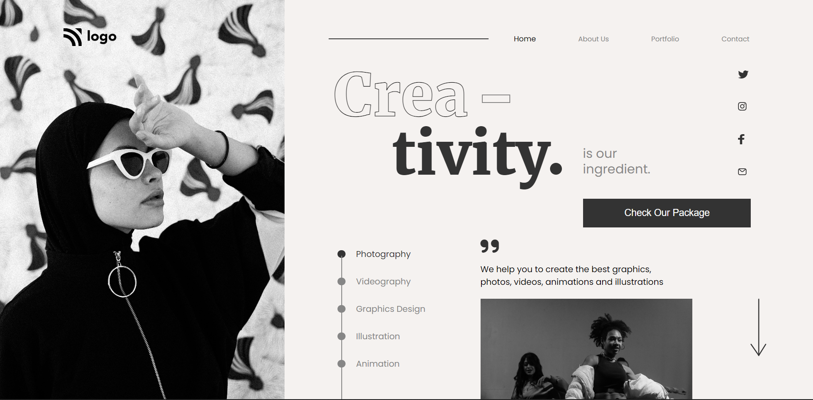

# Project 14 | Creativity  

### By Chhakuli zingare

## 🔗Live Link -: [Creativity  ](https://project14-creativity.netlify.app/)
 

---

---

## What I learned from this Project

- I learned how we can z-index
- Learned to position many things

## This project took around 4 hours to complete.